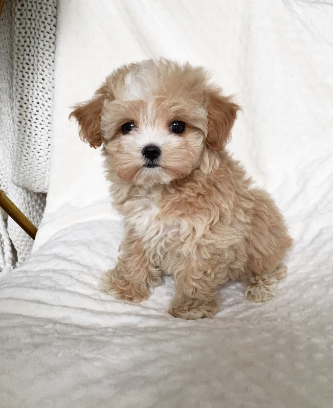

```{r setup, include=FALSE}
knitr::opts_chunk$set(echo = TRUE)
```

## Introduction

-   *Name*: Jia Jack Teo
-   *From*: Malaysia
-   *DOB*: 11/22/1996
-   *Program*: Master of Science in Statistics
-   *Expected Graduation*: May 2023

## Favorite Animal

{width="303"}

## Favorite Plot

```{r, message=FALSE, echo=FALSE}
library(mclust) 
library(ggplot2)
data(banknote)
banknote$Status <- factor(banknote$Status)
ggplot(banknote, aes(x = Bottom, fill = Status)) + 
  geom_histogram(color = 1, alpha = 0.75, position = "identity", bins=20) +
  scale_fill_manual("legend", values = c("counterfeit" = "blue", "genuine" = "orange"))+
   labs(title="Histogram of Bottom")
```

## CV Link

Here's the link to my [CV](https://github.com/stat850-unl/11-presentation-jiajackteo96/blob/master/cv.pdf)

